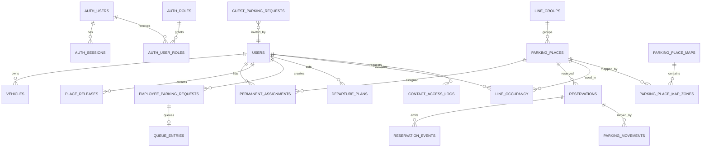

# ERD Draft

## Main Entities

## Table Notes

### `auth_users`

- web UI credentials
- login, password hash, status
- used only for web access

### `auth_roles`

- role catalog
- initial values: `system_admin`, `parking_admin`

### `users`

- employee directory
- messenger external ids
- contact info

### `parking_places`

- canonical place catalog
- type: `single`, `double`, `triple`
- optional `line_group_id`
- map binding data

### `permanent_assignments`

- long-lived employee-to-place ownership
- active interval support

### `reservations`

- concrete place allocation for one date
- source: `manual`, `auto`, `queue`, `guest`, `permanent`

### `reservation_events`

- immutable event stream for reservation lifecycle
- created, moved, canceled, reassigned, confirmed

### `parking_movements`

- explicit move from place A to place B
- actor and reason are required

### `parking_place_maps`

- floor map metadata
- file reference, floor, version

### `parking_place_map_zones`

- clickable map zones
- zone geometry linked to `parking_places`

## Core Constraints

- one place cannot have two active reservations for the same date
- one employee cannot have more than one active parking request per date
- one line position cannot be occupied by two entities for the same date
- move operations must be transactional with reservation history writes
- auth and role changes must be auditable

