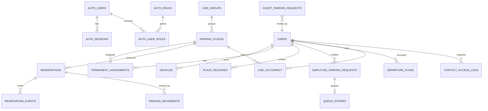

# ERD Draft

## Main Entities

```mermaid
erDiagram
    AUTH_USERS ||--o{ AUTH_SESSIONS : has
    AUTH_ROLES ||--o{ AUTH_USER_ROLES : grants
    AUTH_USERS ||--o{ AUTH_USER_ROLES : receives

    USERS ||--o{ VEHICLES : owns
    USERS ||--o{ PERMANENT_ASSIGNMENTS : has
    USERS ||--o{ PLACE_RELEASES : creates
    USERS ||--o{ EMPLOYEE_PARKING_REQUESTS : creates
    USERS ||--o{ DEPARTURE_PLANS : sets
    USERS ||--o{ LINE_OCCUPANCY : occupies
    USERS ||--o{ CONTACT_ACCESS_LOGS : requests

    LINE_GROUPS ||--o{ PARKING_PLACES : groups
    PARKING_PLACES ||--o{ PERMANENT_ASSIGNMENTS : assigned
    PARKING_PLACES ||--o{ RESERVATIONS : reserved
    PARKING_PLACES ||--o{ LINE_OCCUPANCY : used_in

    EMPLOYEE_PARKING_REQUESTS ||--o| QUEUE_ENTRIES : queues
    GUEST_PARKING_REQUESTS }o--|| USERS : invited_by

    RESERVATIONS ||--o{ RESERVATION_EVENTS : emits
    RESERVATIONS ||--o{ PARKING_MOVEMENTS : moved_by
```

## Table Notes

### `auth_users`

- web UI credentials
- login, password hash, status
- used only for web access

### `auth_roles`

- role catalog
- initial values: `system_admin`, `parking_admin`

### `users`

- employee directory
- messenger external ids
- contact info

### `parking_places`

- canonical place catalog — one row per **slot**
- `place_type` (`single` / `double` / `triple`) is derived from the owning
  `line_groups.capacity`, never edited independently
- `line_group_id NOT NULL` — every place belongs to a line, even a single
- `line_position_hint` is the slot's physical position in the line, 1 = front
- `place_role` (`regular` / `rotatable` / `blocked`) — `rotatable` marks the
  guest pool, `blocked` takes one slot out of service
- `is_active` / `deleted_at` — archiving. Places are never hard-deleted, so
  reservations, releases, occupancy and audit history stay readable.

### `permanent_assignments`

- long-lived employee-to-place ownership
- active interval support

### `reservations`

- concrete place allocation for one date
- source: `manual`, `auto`, `queue`, `guest`, `permanent`

### `reservation_events`

- immutable event stream for reservation lifecycle
- created, moved, canceled, reassigned, confirmed

### `parking_movements`

- explicit move from place A to place B
- actor and reason are required

### `parking_place_maps`

- floor plan metadata: file reference, floor, version
- a **static reference image** only — it has no click targets and no link to
  `parking_places` (see `line_groups` below)

### `line_groups`

- a parking **element**: one line holding 1–3 slots
- `capacity IN (1, 2, 3)` is the source of truth for element size; every active
  `parking_places` row belongs to exactly one group (`line_group_id NOT NULL`)
- `parking_places.place_type` is derived from `capacity` and written by the same
  transaction; `capacity == count(slots) == place_type` is enforced by test
- `display_order` orders the elements in the Места tab; `archived_at` marks an
  element whose slots were all archived

## Core Constraints

- one place cannot have two active reservations for the same date
- one employee cannot have more than one active parking request per date
- one line position cannot be occupied by two entities for the same date
- move operations must be transactional with reservation history writes
- auth and role changes must be auditable

